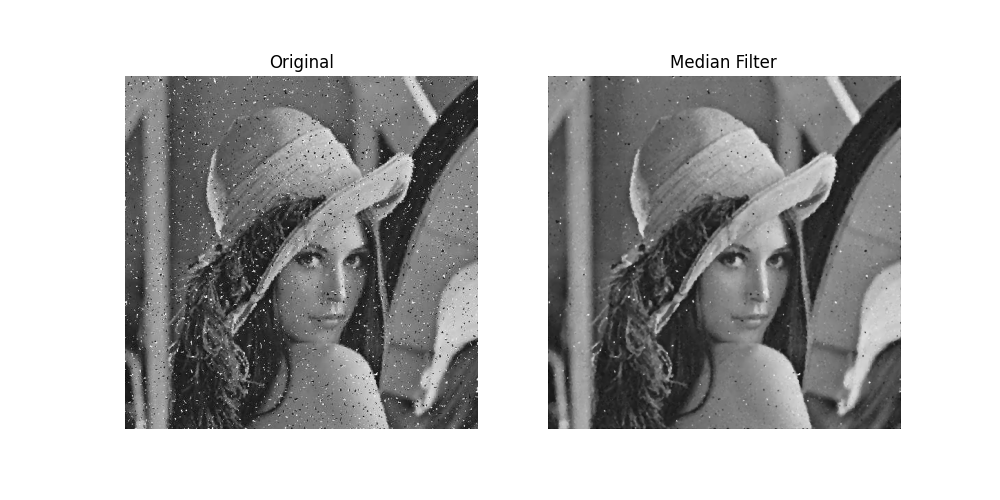
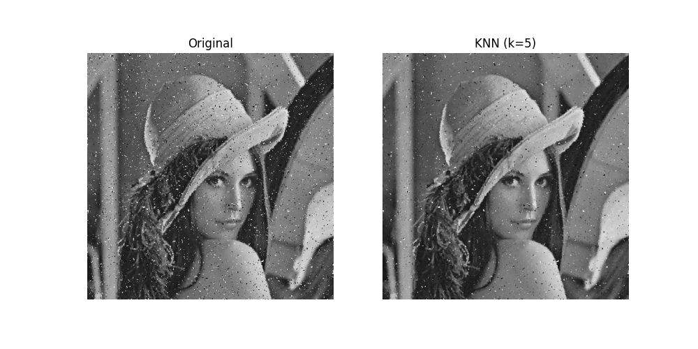
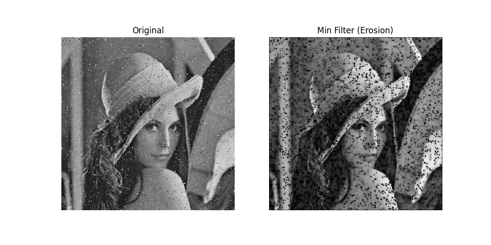
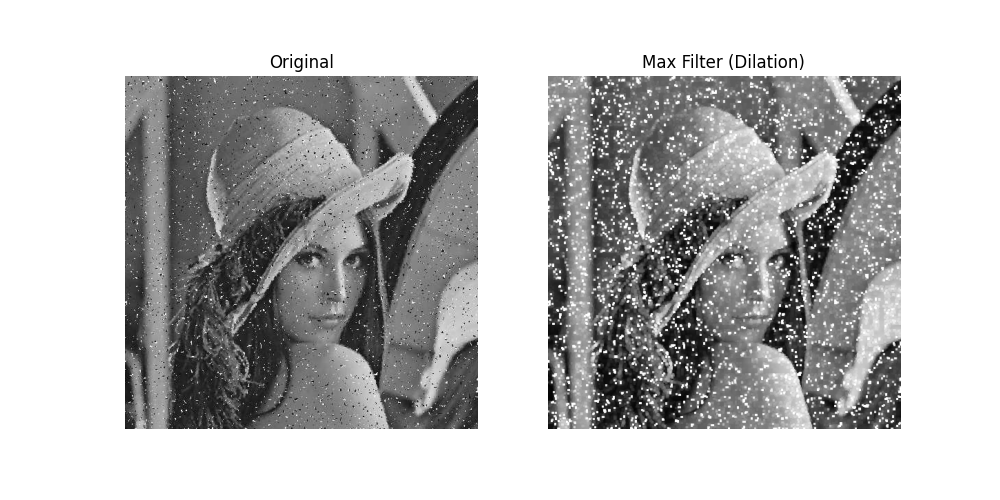
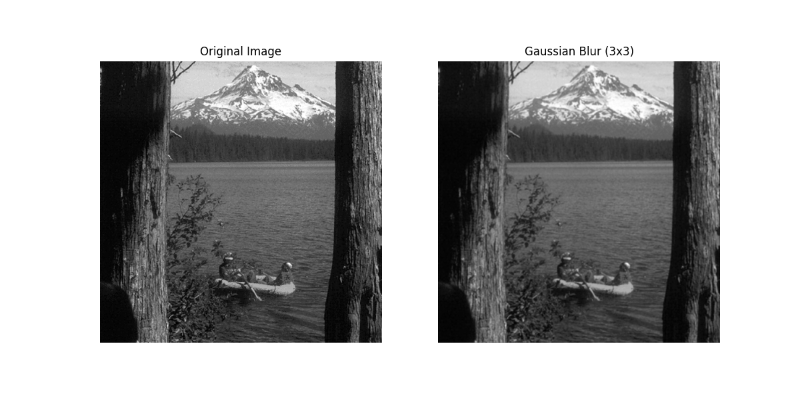

# Image Filtering and Noise Reduction

This project focuses on the manual implementation of various **Spatial Domain Filtering** techniques as part of a **Image Processing** course assignment. The primary goal is to understand the mathematical foundations of image smoothing and noise reduction by developing filtering algorithms from scratch using Python.

## Project Overview
In this coursework, several **Linear** and **Non-linear** filters were implemented without using high-level library functions (like `cv2.blur` or `cv2.medianBlur`). Each filter traverses the image using custom nested loops and mathematical operations such as correlation and pixel ranking.

### Key Features:
* **Zero Padding:** Added to preserve image dimensions and process boundary pixels accurately.
* **Manual Mask Processing:** A 3x3 sliding window mechanism was developed for all spatial operations.
* **Directory Management:** Automated I/O handling with dedicated `/images` for inputs and `/results` for outputs.

## Implemented Filters

### 1. Linear Filters (Smoothing)
* **Average (Box) Filter:** Computes the arithmetic mean of the 3x3 neighborhood.
* **Gaussian Filter:** Uses a weighted average mask for a more natural smoothing effect.

### 2. Non-linear Filters (Order-Statistic)
* **Median Filter:** Replaces the center pixel with the median value of the neighborhood; highly effective against salt-and-pepper noise.
* **K-Nearest Neighbor (KNN):** Averaging only the $k$ pixels ($k=5$) closest in intensity to the center pixel.
* **Min & Max Filters:** Used to reduce specific types of noise by selecting extreme intensity values (Erosion/Dilation).

## Experimental Results

### Noise Reduction on "Lena"
The following results demonstrate the performance of non-linear filters on an image containing salt-and-pepper noise.

| Median Filter | KNN Filter (k=5) |
| :---: | :---: |
|  |  |

| Min Filter (Erosion) | Max Filter (Dilation) |
| :---: | :---: |
|  |  |

### Smoothing on Landscape
Comparison of linear filtering effects on a grayscale landscape image.

| Average Filter (3x3) | Gaussian Blur (3x3) |
| :---: | :---: |
|  |  |
